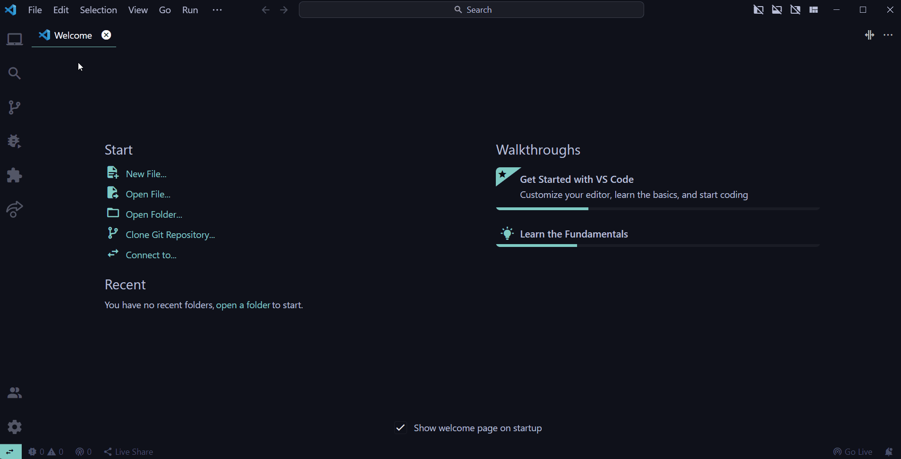

# Web Development (Hello, World!)

**Table of Contents**
- [Introduction](#introduction)
- [Web Development](#web-development)
- [Tools and Software](#tools-and-software)
- [Download VS Code Extensions](#download-vs-code-extensions)
    - [Setup Prettier](#setup-prettier)
    - [Setup Live Server](#setup-liveserver)
- [Setup](#setup)
    - [1. Create a project folder for organizing your files](#1-create-a-project-folder-for-organizing-your-files)
    - [2. Open the project folder in your text editor](#2-open-the-project-folder-in-your-text-editor)
    - [3. Create an HTML file](#3-create-an-html-file)
    - [4. Run your first web page](#4-run-your-first-web-page)
    - [5. Create a CSS file](#5-create-a-css-file)
    - [6. Link your CSS file to your HTML file](#6-link-your-css-file-to-your-html-file)
    - [7. Create a JavaScript file](#7-create-a-javascript-file)
- [Auto Save in VS Code](#auto-save-in-vs-code)
- [Congratulations!](#congratulations)
- [Help](#help)


## Introduction

Welcome to the web development (Hello, World!) guide! This guide is designed to help you get started with web development. It contains a collection of resources to help you setup your development environment and write your first 'hello world' program in HTML, CSS, and JavaScript.

## Web Development

Web development is the process of building websites and applications for the internet. It involves the use of a variety of programming languages, frameworks, and tools to create websites and web applications. In order to get started with web development, you need to have a basic understanding of the following languages:

- [HTML and CSS](/topics/html-css.md)
- [JavaScript](/topics/javascript.md)

And also you need some tools to help you get started such as
- A text editor
- A web browser

## Tools and Software

Before you get started, you need a web brower and a text editor. 

- A web browser is a software application used to access information on the World Wide Web. You can download any of the following web browsers but we recommend using Google Chrome.
    - [Google Chrome](https://www.google.com/chrome/)
    - [Mozilla Firefox](https://www.mozilla.org/en-US/firefox/new/)
    - [Microsoft Edge](https://www.microsoft.com/en-us/edge)
    - [Brave](https://brave.com/)


- A text editor is a program used for editing plain text files. It is used to write and edit code. In order to create webpages and web applications, you need to write web documents in HTML, CSS, and JavaScript. You can use any of the following text editors but we recommend using Visual Studio Code.
    - [Visual Studio Code](https://code.visualstudio.com/)
    - [Sublime Text](https://www.sublimetext.com/)
    - [Atom](https://atom.io/)


## Download VS Code Extensions
After downloading Visual Studio Code, you can install the following extensions to help you get started with web development.
- [Live Server](https://marketplace.visualstudio.com/items?itemName=ritwickdey.LiveServer)
    - This extension launches a development local Server with live reload feature for static & dynamic pages.

- [Prettier](https://marketplace.visualstudio.com/items?itemName=esbenp.prettier-vscode)
    - This extension formats your HTML, CSS, and JavaScript code.

You can also install these extensions by clicking on the `Extensions` icon on the left side of the Visual Studio Code window. Then search for the extensions and click on `Install`.


### Setup Prettier

After installing the Prettier extension, you need to set it as the default formatter for HTML, CSS, and JavaScript files. You can do this by clicking on `File` and selecting `Preferences` and then `Settings`. You can also use the keyboard shortcut `Ctrl + ,` (Windows) or `Cmd + ,` (Mac). Then search for `Default Formatter` and select `Prettier - Code formatter` from the dropdown menu.




### Setup up LiveServer

After installing the Live Server extension, you need to set it as the default browser for HTML files. You can do this by clicking on `File` and selecting `Preferences` and then `Settings`. You can also use the keyboard shortcut `Ctrl + ,` (Windows) or `Cmd + ,` (Mac). Then search for `Live Server > Settings: Custom Browser` and select `Default` from the dropdown menu. (we recommend using Google Chrome as your default browser)

//**Live Server setup gif goes here**///


## Setup

After you have installed a web browser and a text editor, you can now setup your development environment. Let's do that now.

### 1. Create a project folder for organizing your files

First, create a project folder on your computer. You can name it anything you want. For example, you can name it `hello-world`.

### 2. Open the project folder in your text editor

Next, open the project folder in your text editor. You can do this by right-clicking on the project folder and selecting `Open with Code` (This is common for windows users). If you are on other platforms, you can just open Visual Studio Code, click on `File` and select `Open Folder`. Then select the project folder you created in step 1.

///**open folder with vscode gif goes here**///

### 3. Create an HTML file

In your text editor, create a new file and name it `index.html`. This is the file that will contain your HTML code. You can do this by clicking on `File` and selecting `New File`. You can also use the keyboard shortcut `Ctrl + N` (Windows) or `Cmd + N` (Mac). Or you can just click on the new file icon on the left side of the Visual Studio Code window.

///**create a new html file gif goes here**///


**Note:** The `.html` extension indicates that this is an HTML file.

In your `index.html` file, type the following code:

```html
<!DOCTYPE html>
<html>
<head>
    <title>Hello, World!</title>
</head>
<body>
    <h1>Hello, World!</h1>
    <p>This is my first web page.</p>
</body>
```
After typing the code, save the file. You can do this by clicking on `File` and selecting `Save`. You can also use the keyboard shortcut `Ctrl + S` (Windows) or `Cmd + S` (Mac).

### 4. Run your first web page

After saving the file, you can now run your first web page. You can do this by right-clicking on the `index.html` file and selecting `Open with Live Server`. This will open your web page in your default web browser. 

N.B: This will only work if you have installed the Live Server extension.


### 5. Create a CSS file

Next, create a new file and name it `style.css`. This is the file that will contain your CSS code. You can do this by clicking on `File` and selecting `New File`. You can also use the keyboard shortcut `Ctrl + N` (Windows) or `Cmd + N` (Mac). Or you can just click on the new file icon on the left side of the Visual Studio Code window.

**Note:** The `.css` extension indicates that this is a CSS file.

In your `style.css` file, type the following code:

```css
body {
    background-color: turquoise;
    font-family: Arial, Helvetica, sans-serif;
}
```

After typing the code, save the file. You can do this by clicking on `File` and selecting `Save`. You can also use the keyboard shortcut `Ctrl + S` (Windows) or `Cmd + S` (Mac).

### 6. Link your CSS file to your HTML file

Next, you need to link your CSS file to your HTML file. You can do this by adding the following code to your `index.html` file. Place the code between the `<head>` and `</head>` tags.

```html
<link rel="stylesheet" href="style.css">
```

CSS files are linked to HTML files using the `<link>` tag. The `rel` attribute specifies the relationship between the current document and the linked document. The `href` attribute specifies the location of the linked document.

Now save the file. You should see the changes in your web browser.

## Auto Save in VS Code

By now you should have noticed that you have to save your files every time you make changes to them. This can be a bit annoying. But there is a way to automatically save your files in Visual Studio Code. You can do this by clicking on `File` and selecting `Auto Save`. You can also use the keyboard shortcut `Ctrl + Shift + P` (Windows) or `Cmd + Shift + P` (Mac) and type `Auto Save`. Then select `File: Auto Save`.


### 7. Create a JavaScript file

Next, create a new file and name it `script.js`. This is the file that will contain your JavaScript code. By now how to create a new file should be pretty obvious. So I won't go into details.

**Note:** The `.js` extension indicates that this is a JavaScript file.

In your `script.js` file, type the following code:

```js
console.log('Hello, World!');
```

Save the file. But since you have enabled auto save, you don't have to do this manually.

In order to run your JavaScript code, you need to link your JavaScript file to your HTML file. You can do this by adding the following code to your `index.html` file. Place the following code before the closing `</body>` tag.

```html
<script src="script.js"></script>
```

JavaScript files are linked to HTML files using the `<script>` tag. The `src` attribute specifies the location of the linked document.

The output of the JavaScript code will be displayed in the console of your web browser. You can open the console by right-clicking on your web page and selecting `Inspect`. Then click on the `Console` tab. You should see the output of your JavaScript code saying `Hello, World!`.

## Congratulations!

You have successfully setup your development environment and written your first 'hello world' program in HTML, CSS, and JavaScript. Now you can start building your own websites and web applications.

You can now check out the following resources to learn more about web development.

- [Web Development Roadmap](/roadmaps/webdev.md)
- [HTML and CSS](/topics/html-css.md)
- [JavaScript](/topics/javascript.md)


## Help 

If you need help with anything concerning this guide, you can join our [Discord](https://discord.gg/qr7ncUrM6b) community and ask for help in the `#frontend` channel. We're a friendly bunch, so don't be shy!


